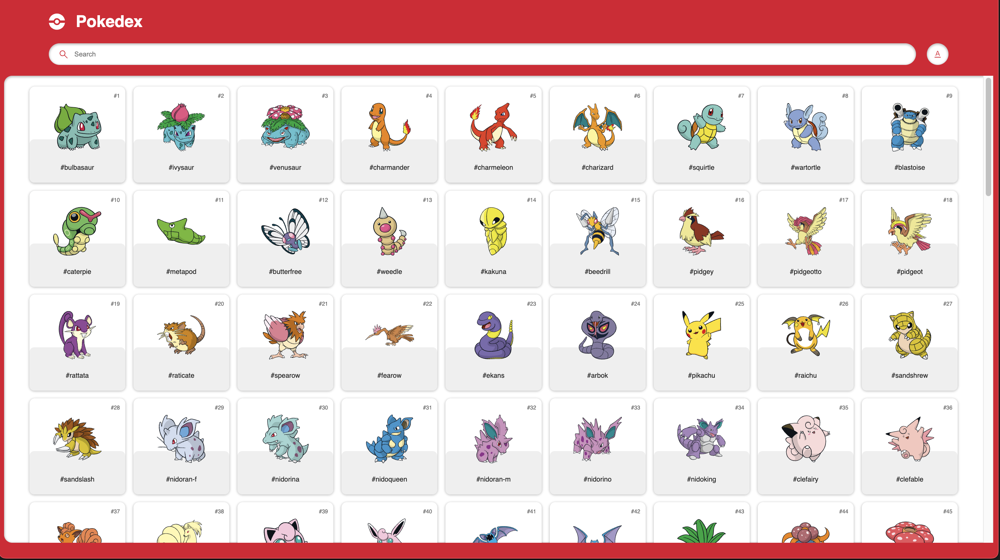

<h1 align="center">Pokedex</h1>

> Developed in [Vanilla JavaScript](https://www.javascript.com/), [HTML](https://www.w3schools.com/html/) & [CSS](https://www.w3schools.com/css/)

<!--  -->

    

## Contents

-   [Project Configuration](#1-project-configuration)
-   [Features](#2-features)

---

### 1. Project Configuration

-   JavaScript: 1.5

### 2. Features

- Search Pokemon by Number or Name
- Display Pokemon detail

 

    

